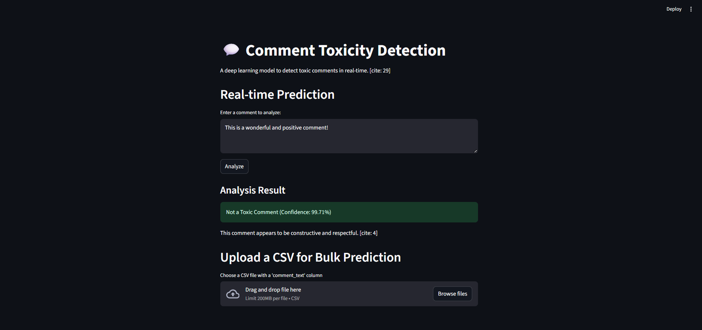
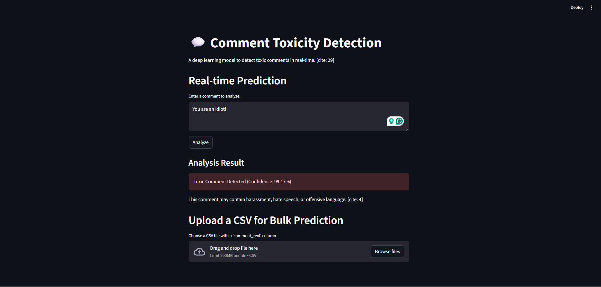

# Deep Learning for Comment Toxicity Detection with Streamlit

[](https://www.python.org/downloads/) [](https://www.tensorflow.org/) [](https://streamlit.io/) []()

A real-time, interactive web application that uses a deep learning model to detect and flag toxic online comments, enhancing content moderation and promoting healthier online communities.

***

## Overview

[cite_start]Online platforms often struggle with toxic comments, such as hate speech and harassment, which disrupt constructive discussions[cite: 4]. [cite_start]This project addresses this challenge by creating an automated system to identify toxic comments in real-time[cite: 5].

[cite_start]We develop a deep learning model based on a Bidirectional LSTM architecture, train it on a labeled dataset of online comments, and deploy it using an interactive Streamlit dashboard[cite: 6, 21, 24]. [cite_start]The final application can analyze user-submitted text and predict the likelihood of it being toxic, assisting moderators in maintaining a safe online environment[cite: 7, 8].

***

## Key Features

* [cite_start]**Real-Time Analysis**: Instantly analyze single comments entered by a user[cite: 25].
* [cite_start]**Bulk Prediction**: Upload a CSV file containing multiple comments for batch processing[cite: 27].
* [cite_start]**Interactive UI**: A user-friendly web interface built with Streamlit for easy interaction and visualization[cite: 25].
* [cite_start]**Deep Learning Backend**: Powered by a TensorFlow/Keras model trained for Natural Language Processing (NLP) tasks[cite: 21, 31].

***

## Business Use Cases

This model can be integrated into various platforms to improve content moderation and brand safety:

* [cite_start]**Social Media Platforms**: Automatically filter toxic comments and posts in real-time[cite: 10].
* [cite_start]**Online Forums & Communities**: Assist moderators in efficiently managing user-generated content[cite: 11].
* [cite_start]**Brand Safety Management**: Ensure advertisements do not appear next to inappropriate or toxic content[cite: 13].
* [cite_start]**E-learning Platforms**: Create safer and more inclusive environments for students and educators[cite: 14].
* [cite_start]**News & Media Outlets**: Moderate comment sections on articles to foster healthier public discourse[cite: 15].

***

## Tech Stack

This project leverages a modern stack for deep learning and web deployment:

* [cite_start]**Programming Language**: Python [cite: 31]
* [cite_start]**Deep Learning**: TensorFlow, Keras, Neural Networks [cite: 31]
* [cite_start]**Web Framework**: Streamlit [cite: 31]
* **Data Manipulation**: Pandas, NumPy
* **Machine Learning**: Scikit-learn
* [cite_start]**Core Skills**: Natural Language Processing (NLP), Model Training & Evaluation, Model Deployment [cite: 1, 31]

***

## Getting Started

Follow these instructions to set up and run the project on your local machine.

### Prerequisites

* Python 3.8+
* `pip` (Python package installer)

### Installation & Setup

1.  **Clone the repository:**
    ```bash
    git clone [https://github.com/your-username/comment-toxicity-detection.git](https://github.com/your-username/comment-toxicity-detection.git)
    cd comment-toxicity-detection
    ```
2.  **Create and activate a virtual environment (recommended):**
    ```bash
    # For Windows
    python -m venv venv
    .\venv\Scripts\activate

    # For macOS/Linux
    python3 -m venv venv
    source venv/bin/activate
    ```
3.  **Install the required dependencies:**
    *Create a `requirements.txt` file with the following content:*
    ```txt
    tensorflow
    pandas
    scikit-learn
    streamlit
    ```
    *Then run:*
    ```bash
    pip install -r requirements.txt
    ```
4.  **Download the Dataset:**
    * This project uses a dataset like the one from the [Kaggle Toxic Comment Classification Challenge](https://www.kaggle.com/competitions/jigsaw-toxic-comment-classification-challenge/data).
    * Download `train.csv.zip` from the "Data" tab.
    * Unzip and place `train.csv` inside a `data/` folder in the project's root directory.
5.  **Train the Model:**
    * Open and run the `toxicity_model_training.ipynb` notebook. [cite_start]This will perform data preprocessing [cite: 19][cite_start], train the LSTM model [cite: 21][cite_start], and save two files: `toxicity_model.h5` and `tokenizer.pickle`[cite: 23].
6.  **Run the Streamlit Application:**
    * Once the model and tokenizer are saved, run the app from your terminal:
    ```bash
    streamlit run app.py
    ```
    * Your web browser will open a new tab at `http://localhost:8501`.

***

## How to Use

Once the application is running, you can:

1.  **Analyze a Single Comment**:
    * Type or paste a comment into the text area under "Real-time Prediction".
    * Click the "Analyze" button.
    * The application will display whether the comment is "Toxic" or "Not Toxic" along with a confidence score.
2.  **Perform Bulk Predictions**:
    * Prepare a CSV file with a header row and a column named `comment_text`.
    * [cite_start]Under "Upload a CSV for Bulk Prediction", click "Browse files" and select your CSV[cite: 27].
    * The app will process the file and display a table with the original comments and their toxicity predictions.
    * You can then download the results as a new CSV file.

##Output


